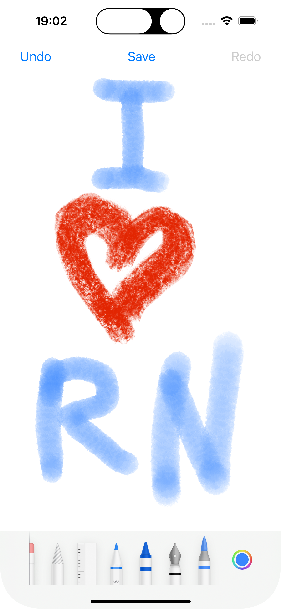

# @ankipro/react-native-canvas-view

React Native library for drawing on iOS, leveraging the power of [Apple PencilKit](https://developer.apple.com/documentation/pencilkit) to provide a seamless and immersive canvas drawing experience. Ideal for applications that require precise and natural drawing capabilities.

## Key Features:
- `Versatile Drawing Tools`: Choose from a variety of drawing tools, including brushes, pencils, erasers, and more.
- `Customizable Brushes`: Customizable brush sizes, colors, and styles.
- `Undo/Redo Functionality`
- `Save`: Save your masterpieces in Base64 format.

<br/>



Made with 💙 by [Anki Pro](https://ankipro.net/) team

## Installation

```sh
yarn add @ankipro/react-native-canvas-view
```
... and pods
```sh
npx pod-install
```


## Basic usage

```js
import CanvasView from "@ankipro/react-native-canvas-view";

// ...

<CanvasView ref={canvasRef} />
```

For more information see [example](./example/src/App.tsx).

## Props

Name | Type | Description
-|-|-
ref | CanvasViewRef | See methods [below](#methods)
style | ViewStyle | Base RN View style
onUndoRedoChange | (undoRedo: {canUndo: boolean; canRedo: boolean}) => void | Check ability undo/redo

## Methods

Name | Type | Description
-|-|-
.showToolbar() | () => void | Show Toolbar
.hideToolbar() | () => void | Hide Toolbar
.undo() | () => void | Reverse the last action
.redo() | () => void | Reapply previously undone action
.getDrawingBase64() | (onComplete: (base64: string) => void) => void | Get Base64 image

## Contributing

See the [contributing guide](CONTRIBUTING.md) to learn how to contribute to the repository and the development workflow.

## License

MIT

---

Made with [create-react-native-library](https://github.com/callstack/react-native-builder-bob)
